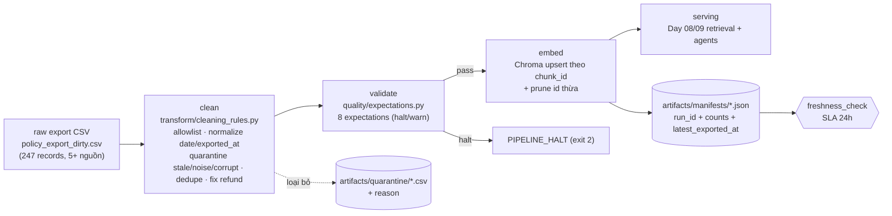

# Kiến trúc pipeline — Lab Day 10

**Nhóm:** _______________ (điền tên nhóm)
**Cập nhật:** 2026-06-10

---

## 1. Sơ đồ luồng

- **run_id**: sinh ở `cmd_run` (UTC timestamp hoặc `--run-id`), gắn vào log, cleaned/quarantine CSV,
  manifest, và metadata mỗi vector → truy vết lineage.
- **Điểm đo freshness**: sau khi ghi manifest, đọc `latest_exported_at` so với SLA.
- **Quarantine**: mọi record bị loại đều ghi ra CSV kèm `reason` (không drop âm thầm).

---

## 2. Ranh giới trách nhiệm

| Thành phần | Input | Output | Owner nhóm |
|------------|-------|--------|--------------|
| Ingest | `data/raw/policy_export_dirty.csv` | list[dict] + `raw_records` | Ingestion Owner |
| Transform | raw rows | cleaned rows + quarantine + `cleaned_*.csv` | Cleaning/Quality Owner |
| Quality | cleaned rows | `ExpectationResult[]` + cờ halt | Cleaning/Quality Owner |
| Embed | `cleaned_*.csv` | Chroma collection `day10_kb` (upsert/prune) | Embed Owner |
| Monitor | manifest JSON | freshness PASS/WARN/FAIL | Monitoring/Docs Owner |

---

## 3. Idempotency & rerun

- **Upsert theo `chunk_id`** = `sha256(doc_id|chunk_text|seq)[:16]` → chạy 2 lần cùng input không tạo vector trùng.
- **Prune**: mỗi run xoá các id có trong collection nhưng không còn trong cleaned hiện tại
  (index = snapshot publish) → tránh "mồi cũ" trong top-k (vd chunk "14 ngày" sau khi inject rồi clean lại).
- Rerun cùng CSV → cùng tập `chunk_id` → collection ổn định, grading lặp lại được.

---

## 4. Liên hệ Day 09

- Cùng `data/docs/` (5 tài liệu CS + IT Helpdesk) như Day 08/09, nhưng Day 10 xử lý **lớp export raw (CSV)**
  mô phỏng ingest từ DB/API trước khi embed.
- Tách collection riêng `day10_kb` (khác Day 09) để before/after và inject corruption không phá index Day 09.
- Sau khi pipeline publish, collection này có thể thay thế nguồn retrieval cho multi-agent Day 09.

---

## 5. Rủi ro đã biết

- **Freshness SLA tĩnh 24h** không hợp dữ liệu lab cố định (export tháng 4/2026) → luôn FAIL; cần phân biệt tuổi-nguồn vs tuổi-publish.
- **Embedder phụ thuộc ngôn ngữ**: model EN-only xếp hạng kém tiếng Việt (đã đổi sang multilingual).
- **Rule corruption heuristic** (lặp từ/meta-leak) có thể false-positive trên corpus lớn hơn.
- **Conflict version** (HR 10 vs 12 ngày, refund 14 vs 7) phụ thuộc marker nội dung — nếu nguồn đổi cách diễn đạt, rule phải cập nhật.
